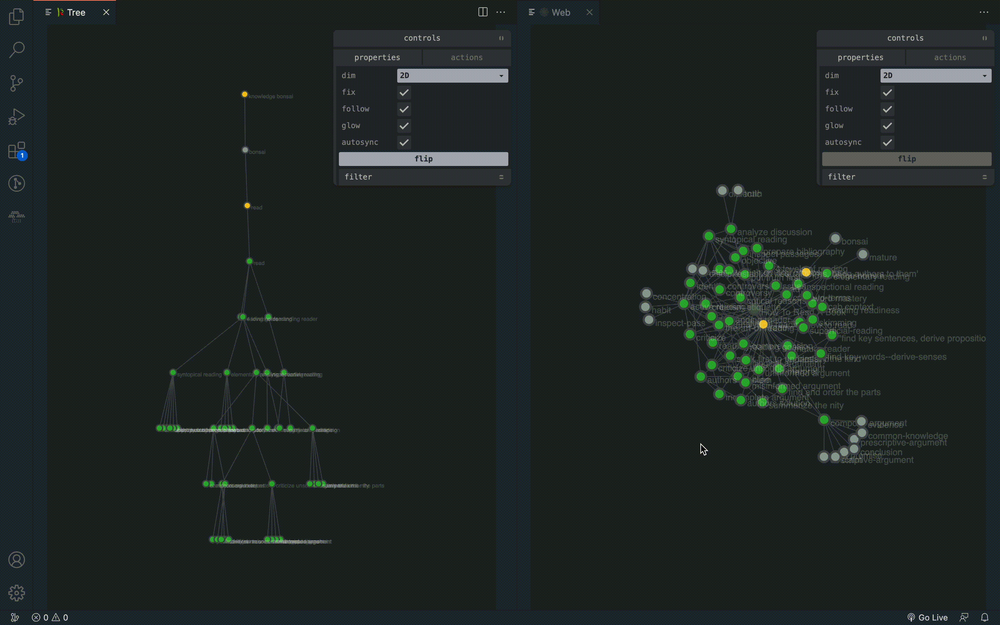
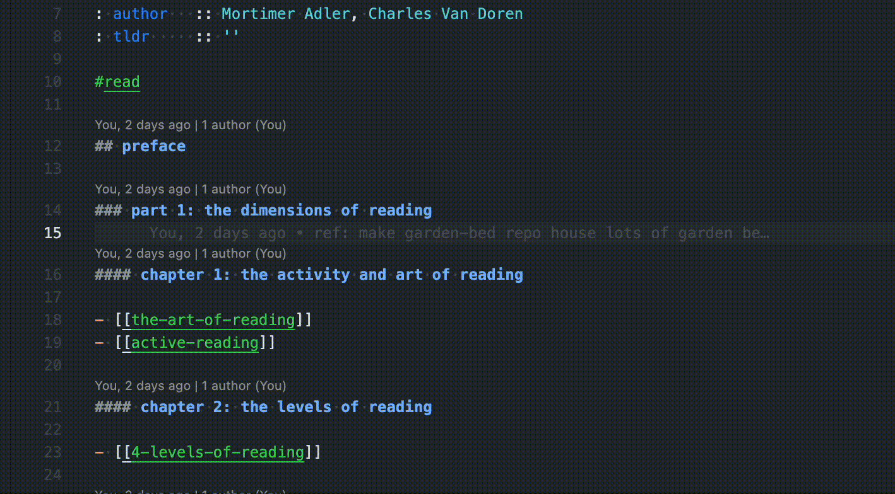
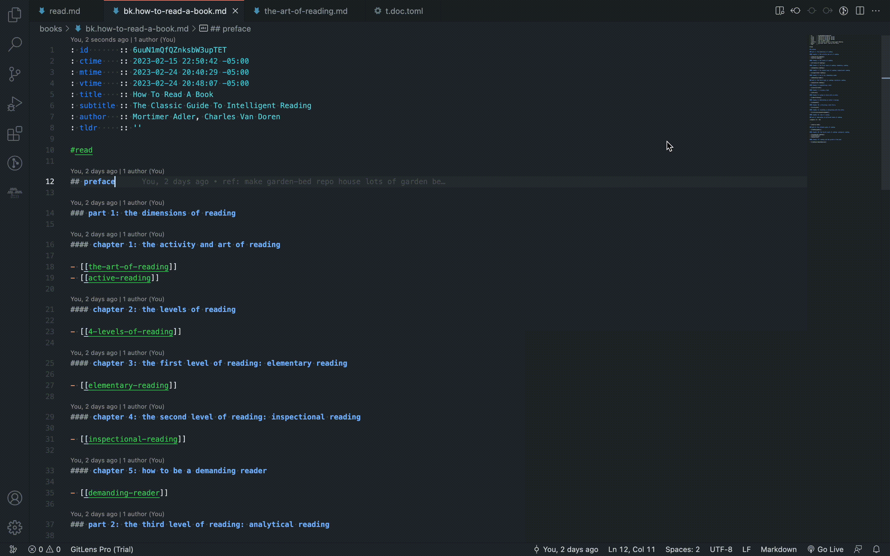

# 🎋 vscode-wikibonsai

[](https://github.com/wikibonsai/wikibonsai)
[](https://marketplace.visualstudio.com/items?itemName=manunamz.vscode-wikibonsai)

<div style="width:50%; margin: auto; padding-block: 2em; display: flex; justify-content: center;">
  
</div>

`vscode-wikibonsai` is a vscode extension that transforms a collection of markdown files into a jungle gym for thought with an API for the mind. It's a personal knowledge management (PKM) system that's got [`[[wikirefs]]`](#wikiref), [semantic trees](#semantic-tree), and [graphs](#graph) that you can visualize on screens, in headets, or map to [embeddings](#embeddings)!

🧑‍🌾 🚰 ✂️ Tend your [🎋 WikiBonsai](https://github.com/wikibonsai/wikibonsai) digital garden from vscode.

⚠️ 🌱 This project is newly sprouted! So please consider it a beta: Remember to backup all data and please use version control.

## Getting Started

Checkout one of the [garden-beds](https://github.com/wikibonsai/garden-beds) for starter digital gardens.

## Why Another VSCode Extension?

The first and foremost reason to use `vscode-wikibonsai` is that each component has been modularized and released as a separate package. So by submitting issues or feature requests for this vscode extension, the changes and updates that result will percolate out to the other open source packages, thereby **improving the open source PKM tool chain for everyone**.

For example, if you want to use the same `[[wikiref]]` syntax for your notes from this extension in a personal blog, you can use the [markdown-it plugin](https://github.com/wikibonsai/markdown-it-wikirefs) with [eleventy](https://github.com/wikibonsai/eleventy-wikibonsai), or the [remark plugin](https://github.com/wikibonsai/remark-wikirefs) with [astro](https://github.com/wikibonsai/astro-wikibonsai), etc. Then, any bugs or features added to the wikiref syntax for `vscode-wikibonsai` will also be applied to the frameworks that power your blog.

## Tell Me More!

For more details about the parent project, head to the [WikiBonsai](https://github.com/wikibonsai/wikibonsai) repo. Otherwise, keep scrolling!

---

## Table of Contents

- [Config File](#config-file)
- [Doctypes](#doctypes)
  - [Declaration File](#doctype-declaration-file)
  - [DocType Properties](#doctype-properties)
  - [Type Resolution](#type-resolution)
  - [Affix Variables](#affix-variables)
  - [Built-In DocTypes](#built-in-doctypes)
  - [DocKinds](#dockinds)
- [Markdown Syntax](#markdown-syntax)
  - [`[[wikirefs]]`](#wikirefs)
  - [Metadata](#metadata)
    - [`:caml::attributes`](#caml)
    - [YAML Frontmatter](#yaml-frontmatter)
  - [`#tags`](#tags)
  - [More...](#more-markdown)
- [Semantic Tree](#semantic-tree)
- [Graph](#graph)
  - [Kinds](#kinds)
  - [Dimensions](#dimensions)
  - [Interactivity](#interactivity)
    - [Graph Actions](#graph-actions)
    - [Graph Properties](#graph-properties)
- [Workflows](#workflows)
  - [Auto-update attribute metadata](#auto-update-attribute-metadata)
  - [Follow Link](#follow-link)
  - [Hover Preview](#hover-preview)
  - [Markdown Preview](#markdown-preview)
  - ⚠️ [Remote Codespaces](#remote-codespaces)
  - [Rename File Sync](#rename-file-sync)
  - [Rename From Symbol](#rename-from-symbol)
  - [Syntax Highlights](#syntax-highlights)
  - [Tab Completion](#tab-completion)
  - [Wizard](#wizard)
- [Treeviews](#treeviews)
  - [Tree-Based](#tree-based-treeviews)
  - [Web-Based](#web-based-treeviews)
  - [Partial-Based](#part-based-treeviews)
- [VSCode Commands](#commands)
- [VSCode Configs](#configs)
- [Embeddings](#embeddings)
- [Index](#index)

---

## Config File

There is a local config file to configure some aspects of your digital garden, such as what [attr engine](#metadata) to use. Config file syncs with vscode extension configurations.

Supported file formats:

- [toml](https://toml.io/en/)
- [yaml](https://yaml.org/)

Defaults to `configs.toml` -- here is a sample:

```toml
[garden]
  title      = "wikibonsai"
  root       = "i.bonsai"
  attrs      = "caml"
[doc]
  [doc.kind]
    [doc.kind.doc]
      path   = "/"
      color  = "#3e5c50"
    [doc.kind.zombie]
      emoji  = "🧟"
      color  = "#959DA5"
    [doc.kind.template]
      path   = "/template/"
      prefix = "t."
      emoji  = "🧩"
      color  = "#F8F0E3"
```

- `attrs` determines which attr engine to use for [file metadata](#metadata).
- `doc.kind` defines the [doctype properties](#doctype-properties) for the special WikiBonsai `dockinds`.
- `root` defines the root filename for the bonsai. It should be an `index` doctype.

## DocTypes

WikiBonsai provides an optional type system for your markdown files. Types are fundamental in adding semantic information to the web and facilitates the beginning of [semantic spatial mapping]().

### DocType Declaration File

[Doctype properties](#doctype-properties) may be defined in the doctype declaration file. Supported file formats:

- [toml](https://toml.io/en/)
- [yaml](https://yaml.org/)

Defaults to `t.doc.toml` -- which looks like:

```toml
[default]
path   = "/"
color  = "#3e5c50"
[index]
path   = "/index/"
prefix = "i."
emoji  = "🗄"
color  = "#F0C61F"
# emoji  = "🪵"
root   = "bonsai" # index-specific property
[entry]
path   = "/entry/"
emoji  = "🏷"
color  = "#31AF31"
# emoji  = "🍃"
```

The following is an `example` doctype that illustrates the possible properties:

```toml
# doctype resolution: path < attr < prefix
[example]
# 'path' defines the relative path in vault to what files should map to this doctype
path = "relative/path/to/docs/"
# 'attr' defines what attribute key should map to this doc type -- defaults to the name of this type entry which is 'example' here
attr = "example-key"
# 'prefix' defines what filename prefix may trigger this type (useful for cmd/ctrl+click to create new doc from template)
prefix = "prefix."
# 'suffix' to append to new doc (useful for appending unique ids)
suffix = "-suffix"
# name of the type's template (defaults to 't.<typename>')
template = "template-name"
# 'emoji' to apply in treeviews and list formats
emoji = "🤓"
# 'color' to apply in [[wikilinks]], graph nodes, and other color-coded identifiers
color = "#FFF"
```

### DocType Properties

- `attr`: Defines what `:caml::attribute` key should map to this doc type -- defaults to the name of this type entry which is 'example' here
- `color`: Color to apply to `[[wikilinks]]`, graph nodes, and other color-coded identifiers.
- `emoji`: Emoji to apply in treeviews and list formats.
- `path`: Relative path within the vault directory, should map to this doc type (similar to jekyll).
- `prefix`: Defines the filename prefix for this type. It is automatically generated upon file creation and allows for the creation of a particular doctype from a `[[zombie-wikiref]]` if the prefix is included in the wikitext (ex: clicking on `[[prefix.zombie-wikiref]]` will produce a new file of the doctype that has the given prefix "`prefix.`"). Also supports some [affix vars](#affix-variables).
- `suffix`: Defines the filename suffix for this type and gets automatically generated upon file creation. Also supports some [affix vars](#affix-variables).
- `template`: Name of the type's template (defaults to 't.<typename>')

### Type Resolution

- Type resolution by precedence (similar to how [jekyll collections](https://jekyllrb.com/docs/collections/) works: by defining a `collections` directory with the ability to override it with the `collections` frontmatter var):
  1. Filename prefix.
  2. Metadata (caml or yaml) `type` definition.
  3. Directory location.

### Affix Variables

These variables can be used in `prefix` and `suffix` [doctype properties](#doctype-properties):

- `:id`: Generate an id from [nanoid](https://github.com/ai/nanoid).
- `:date`: Generate the current date (format: `YYYY-MM-DD`).
- `:year`: Generate the current year (format: `YYYY`).
- `:month`: Generate the current month (format: `MM`).
- `:day`: Generate the current day (format: `DD`).
- `:hour`: Generate the current hour (format: `HH`).
- `:minute`: Generate the current minute (format: `mm`).

### Built-In DocTypes

The semantic tree/knowledge bonsai expects the following doctypes to exist:
- **`index`**: files with markdown-style list outlines of `[[wikilinks]]` to (primarily) `index` and `entry` docs. These type of documents are used to build the trunk and branches of the bonsai.
- **`entry`**: Wikipedia-style entries that build the leafs of the bonsai. Each one is meant to map to a particular sense of a word using wikipedia-style-(disambiguation-parens).

### DocKinds

Doctypes are distinct from "`dockinds`" -- or "kinds" of documents. DocKinds have very specific behaviors in WikiBonsai. The built-in kinds are `doc`, `media`, `template`, and `zombie`:

- **Doc** is the generic kind of document and will subsequently look for the correct doctype when a file is this kind of document.
- **Media** corresponds to file types (`.png`, `.mp3`, `.mp4`, etc.) that are render-able in `![[wikiembeds]]`.
- **Templates** are skeleton documents whose contents are pasted into new files of that particular doctype.
- **Zombies** are various entities that represent a document that does not exist. `[[WikiLinks]]` without a document or a node in the graph without a document are examples of zombie entities.

## Markdown Syntax

WikiBonsai adds [`[[wikirefs]]`](#wikirefs), [`:caml::attributes`](#caml), [`#tags`](#tags), and optionally [other markdown extensions](#more-markdown) for all your note-taking and semantic spatial mapping needs.

Also, don't forget to check against vscode's [built-in markdown support](https://code.visualstudio.com/docs/languages/markdown).

### WikiRefs

Uses the [wikirefs](https://github.com/wikibonsai/wikirefs) project.

- wikiattrs: `:attribute::[[wikiattr]]`
- wikilinks: `[[wikilink]]`
- wikiembeds: `![[wikiembed]]`

See [wikirefs-spec](https://github.com/wikibonsai/wikirefs/tree/main/spec) for full syntax specification.

### Metadata

Default metadata looks like this (which is overidable in the `default` doc template):

```json
let attrData: any = {
    "id": "<a-nanoid-id>",
    "ctime": "YYYY-MM-DD HH:MM +/-TZ",
    "mtime": "YYYY-MM-DD HH:MM +/-TZ",
    "vtime": "YYYY-MM-DD HH:MM +/-TZ",
    "title": "unslugified file name",
    "tldr": "\"\"",
  };
```

The following file metadata / attribute formats are supported:

#### CAML

Uses the [caml](https://github.com/wikibonsai/caml) project.

(`:compatible-with::[[wikiattrs]]`)

```markdown
: id    :: <a-nanoid-id>
: ctime :: YYYY-MM-DD HH:MM +/-TZ
: mtime :: YYYY-MM-DD HH:MM +/-TZ
: vtime :: YYYY-MM-DD HH:MM +/-TZ
: title :: unslugified file name
: tldr  :: ""
```

See [caml-spec](https://github.com/wikibonsai/caml/tree/main/spec) for fyll syntax specification.

#### YAML Frontmatter

```yaml
---
id: <a-nanoid-id>
ctime: YYYY-MM-DD HH:MM +/-TZ
mtime: YYYY-MM-DD HH:MM +/-TZ
vtime: YYYY-MM-DD HH:MM +/-TZ
title: YYYY-MM-DD HH:MM +/-TZ
tldr: ""
---
```

See [YAML](https://yaml.org/) for more.

### Tags

`#tags` in WikiBonsai have a particular meaning: The tag text maps to a (slugified) filename and clicking on the tag takes you to the file's location in the [semantic tree](#semantic-tree), which is the wikilink (e.g. `[[tag]]`) of the same name that appears in an `index` document. (Though this can be [configured](#configs) to act more like [Roam Research style `#tags`](https://www.reddit.com/r/RoamResearch/comments/h8v3uk/differences_between_page_link_and_a_tag_technical/) and take you to the file itself instead)

⚠️ Only [syntax highlights](#syntax-highlights) and [cmd/ctrl+click to follow](#follow-link) -- and only if filenames match exactly e.g. not using whitespace)

#### More Markdown

- ❌ [abcjs](https://www.abcjs.net/)
- ❌ [argdown](https://argdown.org/)
- ✅ [critic markup](https://fletcher.github.io/MultiMarkdown-6/syntax/critic.html)
- ✅ [ditaa](https://ditaa.sourceforge.net/)
- ✅ [DOT](https://graphviz.gitlab.io/doc/info/lang.html)
- ✅ [highlightjs](https://highlightjs.org/)
- ✅ [katex](https://katex.org/)
- ❌ [markviz](https://markvis.js.org/#/)
- ❌ [mermaid](https://mermaid.js.org/) (install via [vscode-markdown-mermaid](https://github.com/mjbvz/vscode-markdown-mermaid/))
- ✅ [PlantUML](https://plantuml.com/)
- ❌ [vextab](https://vexflow.com/vextab/)

## Semantic Tree

Uses the [semtree](https://github.com/wikibonsai/semtree) project.

Orient yourself within your WikiBonsai digital garden by cultivating a semantic tree. The tree is built from `index` doctypes, whose markdown files should be composed of [metadata attributes](#metadata) and a markdown list outline, which should look something like this:

```markdown
// i.bonsai.md

: title :: knowledge bonsai

// ⚠️ Make sure each indentation level uses the same spacing!
// (2, 4, 6, etc. whitespaces or a single tab).

- [[branch-1]]
- [[branch-2]]
  - [[leaf-2a]]
- [[branch-3]]
  - [[leaf-3a]]
  - [[leaf-3b]]
  - [[leaf-3c]]
```

This file will build a tree that looks like this:


You can also split the tree up into multiple files.

```markdown
// i.bonsai.md

: title :: knowledge bonsai

- [[branch-1]]
- [[branch-2]]
  - [[leaf-2a]]
- [[i.branch-3]]
```

```markdown
// i.branch-3.md

: title :: third branch

- [[leaf-3a]]
- [[leaf-3b]]
- [[leaf-3c]]
```

This file will build a tree that looks like this:


⚠️ Also note that the semantic tree intializes on startup, but it does not stay in sync at all times. In order to re-sync the semantic tree in vscode with what is in your files, just use the `wikibonsai: sync bonsai` [command](#commands).

## Graph

Uses the [treehouze](https://github.com/wikibonsai/treehouze) project.

Open the tree graph with the `wikibonsai: open tree graph` and the web graph with the `wikibonsai: open web graph` commands or via the buttons the bonsai [treeview panel](#treeviews).

<div style="width:75%; margin: auto; padding-block: 2em; display: flex; justify-content: center;">
  
</div>

### Dimensions

The graph may be converted to several different dimensions and will maintain its integrity (the same shape, etc.) throughout each transformation.

- ✅ 2d
- ✅ 3d
- ✅ vr
- ❌ ar (code is there, but not functional)

<div style="width:75%; margin: auto; padding-block: 2em; display: flex; justify-content: center;">
  
</div>

### Kinds

There are two kinds of graphs (that may be opened simultaneously):

- 🕸 Web graph built from [`[[wikirefs]]`](#wikirefs).

<div style="width:75%; margin: auto; padding-block: 2em; display: flex; justify-content: center;">
  
</div>

- 🌳 Tree graph built from the [semantic tree](#semantic-tree).

<div style="width:75%; margin: auto; padding-block: 2em; display: flex; justify-content: center;">
  
</div>

### Interactivity

#### Graph Actions

- **Hover** on node to highlight it and its relationships or on a link to highlight it and the connected nodes.

<div style="width:75%; margin: auto; padding-block: 2em; display: flex; justify-content: center;">
  
</div>

- **Click** on node to center node in graph.

<div style="width:75%; margin: auto; padding-block: 2em; display: flex; justify-content: center;">
  
</div>

- **Cmd/Ctrl + Click** to open node in editor.

<div style="width:75%; margin: auto; padding-block: 2em; display: flex; justify-content: center;">
  
</div>

- **Shift + Click + Drag** to select a group of nodes (to drag).

<div style="width:75%; margin: auto; padding-block: 2em; display: flex; justify-content: center;">
  
</div>

- **Click** on the background to de-select all nodes.

<div style="width:75%; margin: auto; padding-block: 2em; display: flex; justify-content: center;">
  
</div>

- **Drag** selected node or group of nodes. If `fix` option is on, nodes will fix in-place it was dragged to.

<div style="width:75%; margin: auto; padding-block: 2em; display: flex; justify-content: center;">
  
</div>

- **Save** node coordinates to `.json` file (separate file for `tree` and `web`). (Useful if you're interested in playing with [embeddings](#embeddings))

<div style="width:75%; margin: auto; padding-block: 2em; display: flex; justify-content: center;">
  
</div>

- **Sync** graph data with files manually.

<div style="width:75%; margin: auto; padding-block: 2em; display: flex; justify-content: center;">
  
</div>

#### Graph Properties

- Dynamic node **coloration** based on doctype.

<div style="width:75%; margin: auto; padding-block: 2em; display: flex; justify-content: center;">
  
</div>

- **Filter** nodes (doc, media, template, zombie) and links (wikiattr, wikilink, wikiembed) by `kind`.

<div style="width:75%; margin: auto; padding-block: 2em; display: flex; justify-content: center;">
  
</div>

- **Fix** nodes to dragged coordinates.

<div style="width:75%; margin: auto; padding-block: 2em; display: flex; justify-content: center;">
  
</div>

- **Flip** the tree along the y-axis.

<div style="width:75%; margin: auto; padding-block: 2em; display: flex; justify-content: center;">
  
</div>

- **Follow** node in the graph that corresponds to the active editor's document.
- **Highlight** node in the graph that corresponds to the active editor's document.

<div style="width:75%; margin: auto; padding-block: 2em; display: flex; justify-content: center;">
  
</div>

- **Toggle auto-syncing** with markdown files.

<div style="width:75%; margin: auto; padding-block: 2em; display: flex; justify-content: center;">
  
</div>

## Workflows

The following are VSCode workflow features.

⚠️ Note: Please be aware that when editing files, such as renaming or moving them, vscode will create a new file, copy over the file content, then delete the old file. this means a file's lifecycle metadata (creation time in particular) won't accurately reflect the real lifecycle of the file. you will have to refer to metadata/file attributes to obtain accurate file lifecycle metadata.

### Auto-update Attribute [Metadata](#metadata)

- The following metadata attributes will auto-update...:
  - `ctime` / `cdate`: ...when a file is **created**.
  - `mtime` / `mdate`: ...when a file is **modified**.
  - `vtime` / `vdate`: ...when a file is **viewed** (e.g. is focused on in the active editor):
- Formats:
  - `time` format: `YYY-MM-DD HH:MM:SS +/-TZ:TZ`
  - `date` format: `YYY-MM-DD`
- Note: Document metadata is not updated when changes are made outside of vscode.

<div style="width:75%; margin: auto; padding-block: 2em; display: flex; justify-content: center;">
  
</div>

### Follow Link

- `Cmd/Ctrl + Click` ...

- ...when file exists, follow [`[[wikirefs]]`](#wikirefs) to file.

<div style="width:75%; margin: auto; padding-block: 2em; display: flex; justify-content: center;">
  
</div>

- ...when file does to exist, use text from `[[wikiref]]` to create new file called `wikiref.md`.

<div style="width:75%; margin: auto; padding-block: 2em; display: flex; justify-content: center;">
  
</div>

- ...when file does to exist, use text from `[[wikiref]]` to create new file called `wikiref.md` -- if it matches a `doctype` prefix, it will create a new document from the template of that `doctype`.

<div style="width:75%; margin: auto; padding-block: 2em; display: flex; justify-content: center;">
  
</div>

- ...follow [`#tag`](#tags) to either its location in the bonsai (e.g. open `index` doc that contains `[[tag]]` wikilink) or the file that matches the tag text (e.g. open `tag.md`).

<div style="width:75%; margin: auto; padding-block: 2em; display: flex; justify-content: center;">
  
</div>

### Hover Preview

- ...for [`[[wikirefs]]`](#wikirefs).

<div style="width:75%; margin: auto; padding-block: 2em; display: flex; justify-content: center;">
  
</div>

### Markdown Preview

- ...for [`[[wikirefs]]`](#wikirefs).
- ...for [`:caml::attributes`](#caml).

<div style="width:75%; margin: auto; padding-block: 2em; display: flex; justify-content: center;">
  
</div>

### Remote Codespaces

This project was careful with internal uris, so it _should_ be possible to use this extension with [remote development and codespaces](https://code.visualstudio.com/api/advanced-topics/remote-extensions).

### Rename File Sync

- Rename corresponding [`[[wikirefs]]`](#wikirefs) on filename change.

<div style="width:75%; margin: auto; padding-block: 2em; display: flex; justify-content: center;">
  
</div>

### Rename From Symbol

- Rename references and filename from [`[[wikirefs]]`](#wikirefs).

<div style="width:75%; margin: auto; padding-block: 2em; display: flex; justify-content: center;">
  
</div>

- Rename `zombie` references and filename from [`[[wikirefs]]`](#wikirefs).

<div style="width:75%; margin: auto; padding-block: 2em; display: flex; justify-content: center;">
  
</div>

- Rename reftype and reftypes (includes both wikiattr and wikilink types) of same name from type text. (Note: Does not work for caml attributes)

<div style="width:75%; margin: auto; padding-block: 2em; display: flex; justify-content: center;">
  
</div>

### Syntax Highlights

- Defaults:
  - `yellow` for `index` doctypes
  - `green` for `entry` doctypes
  - `grey` for `zombie`s.
  - `bright green` for media files and miscillaneous.

- ...for [`[[wikirefs]]`](#wikirefs).
- ...for [`:caml::attributes`](#caml).
- ...for [`#tags`](#tags).

<div style="width:75%; margin: auto; padding-block: 2em; display: flex; justify-content: center;">
  
</div>

### Tab Completion

- ...for [`[[wikirefs]]`](#wikirefs) tab completion. (Tab completion includes zombies -- if there is a `[[wikiref]]` with no corresponding file it is added to the possible completions)

<div style="width:75%; margin: auto; padding-block: 2em; display: flex; justify-content: center;">
  
</div>

- ...for `:reftype::` tab completion for [`:reftype::[[wikiattrs]]`](#wikirefs).

<div style="width:75%; margin: auto; padding-block: 2em; display: flex; justify-content: center;">
  
</div>

### Wizard

Trigger with `ctrl/cmd + k` by default:

- Create document (from doctype template).

<div style="width:75%; margin: auto; padding-block: 2em; display: flex; justify-content: center;">
  
</div>

- Search documents.

<div style="width:75%; margin: auto; padding-block: 2em; display: flex; justify-content: center;">
  
</div>


## Treeviews

VSCode Treeviews to help you to navigate your digital garden and visualize relationships, especially with regard to the document currently open in the active text editor.

<div style="width:45%; margin: auto; padding-block: 2em; display: flex; justify-content: center;">
  
</div>

### Treeview Properties

- Displays emoji of the document's given `doctype`.
- Colorized bullet point that matches the document's doctype.
  - ⚠️ only works for `default` and `zombie` dockinds.

### Treeview Actions

**Hit the refresh button** to refresh the treeview's data from the underlying [index](#index).

<div style="width:45%; margin: auto; padding-block: 2em; display: flex; justify-content: center;">
  
</div>

**Click** on a treeview item to navigate to its file if it exists.

<div style="width:45%; margin: auto; padding-block: 2em; display: flex; justify-content: center;">
  
</div>

**Click the plus symbol** if there is no file (zombie) to create a new file from the doc default.

<div style="width:45%; margin: auto; padding-block: 2em; display: flex; justify-content: center;">
  
</div>

**Click the plus symbol in a circle** if there is no file (zombie) to create from a template -- you will be prompted to edit the filename before finally creating the file.

<div style="width:45%; margin: auto; padding-block: 2em; display: flex; justify-content: center;">
  
</div>

### Tree-Based Treeviews

- **Bonsai**: Display the full bonsai.
  - The bonsai treeview also has some action buttons:
    - Open web graph.
    - Open tree graph.
    - Sync bonsai with index files.
    - The standard refresh bonsai treeview.

<div style="width:25%; margin: auto; padding-block: 2em; display: flex; justify-content: center;">
  
</div>

- **Ancestry**: Display the ancestral path from the root of the bonsai to the current document.
- **Children**: Display the children of the current document in the bonsai.

<div style="width:25%; margin: auto; padding-block: 2em; display: flex; justify-content: center;">
  
</div>

### Web-Based Treeviews

- **ForeRefs**: Display all forward references, which includes subsections for forward facing (wiki)attrs, (wiki)links, and (wiki)embeds. (`attrs` will list types, which further list the files themselves.)
- **BackRefs**: Display all backward references, which includes subsections for back facing (wiki)attrs, (wiki)links, and (wiki)embeds. (`attrs` will list types, which further list the files themselves.)

<div style="width:25%; margin: auto; padding-block: 2em; display: flex; justify-content: center;">
  
</div>

### Part-Based Treeviews

- **Orphans and Floaters**: Documents that are not connected to the tree (orphan) and/or the web (floater). Each are denoted by a tree and web emoji.
- **Zombie**: `[[WikiRefs]]` without a corresponding document; also lists the documents the reference appears in.

<div style="width:25%; margin: auto; padding-block: 2em; display: flex; justify-content: center;">
  
</div>

## Commands

To see all possible commands, open the [VSCode command palette](https://code.visualstudio.com/api/ux-guidelines/command-palette) and type "wikibonsai". But keep in mind that there are several vscode commands in the WikiBonsai extension that are not meant for use in VSCode. They are used internally and should probably be left alone.

Target commands are listed here:

- [Graph](#graph):
  - `wikibonsai: open tree graph`: Open the tree graph.
  - `wikibonsai: open web graph`: Open the web graph.
  - `wikibonsai: toggle on/off active doc following in graph`: toggle whether the graph should center on the node of the document in the active editor.
  - `wikibonsai: toggle on/off fixed nodes in graph`: toggle whether nodes should used fixed coordinates in the graph or not.
- [Semantic Tree](#semantic-tree):
  - `wikibonsai: sync bonsai`: Sync the semantic tree with the index documents/files.
- [Treeviews](#treeviews):
  - `wikibonsai: refresh bonsai panel`: Refresh the Bonsai Treeview Panel.
  - `wikibonsai: refresh ancestors panel`: Refresh the Ancestor Treeview Panel.
  - `wikibonsai: refresh children panel`: Refresh the Children Treeview Panel.
  - `wikibonsai: refresh forerefs panel`: Refresh the ForeRefs Treeview Panel.
  - `wikibonsai: refresh backrefs panel`: Refresh the BackRefs Treeview Panel.
  - `wikibonsai: refresh orphans panel`: Refresh the Orphans Treeview Panel.
  - `wikibonsai: refresh zombies panel`: Refresh the Zombies Treeview Panel.
- [Wizard](#wizard):
  - `wikibonsai: search and create files from the wikibonsai wizard` (also available via `ctrl/cmd + k`):
    - Begin typing to search documents.
    - Select a doctype/template to create a new file and then after selection type in the target filename.

If you are experiencing issues, you can try using these debug commands:

- Debug:
  - `wikibonsai: dump bonsai to .json file`
  - `wikibonsai: dump index to .json file`
  - `wikibonsai: print link index in console`
  - `wikibonsai: print bonsai in console`
  - `wikibonsai: clear index and rebuild from files`

## Configs

To see the available configurations, open your [workspace settings](https://code.visualstudio.com/docs/getstarted/settings) and type "wikibonsai".

## Embeddings

Since the [graph](#graph-properties) supports fixed node coordinates, it is possible to play around with visualizing your markdown notes alongside [word embeddings](https://en.wikipedia.org/wiki/Word_embedding) if those note filenames correspond to words or word senses.

Just generate a json file called `coords-web.json` (or `coords-tree.json` if you have coordinates for a hierarchical [tree](#semantic-tree) structure), place it at the root of your project.

The data payload should look like the following:

```json
// coords-web.json

{
  "fname-a": [0, 1, 2], // [x, y, z] coordinates
  "fname-b": [0, -1],   // [x, y] coordinates ; z can be left off if desired
  // ...
}
```

## Index

Uses the [caudex](https://github.com/wikibonsai/caudex) project.

There is an internal index to speed things up so that larger gardens may be supported. Precise size support is yet to be determined.

⚠️ The following are some quirks to keep in mind about the index:

- Initialization may still be a touch slow for large gardens (hundreds or thousands of files) when first activating the extension.
- The index relies on the `id` attribute of each document and will lose track of relationships if `id`s are manually edited in files (rather than just letting the extension handle them). This can be fixed simply by restarting the plugin.

## Issues

Feature requests, bugs, and suggestions can be filed in the [issue tracker](https://github.com/wikibonsai/vscode-wikibonsai/issues).

If you want to try tracking down issues yourself, you can check the logs by opening the "WikiBonsai" output channel.

**just keep tending...🪴**

---

##### 🇺🇸 Made in the USA 🦅 🐊
